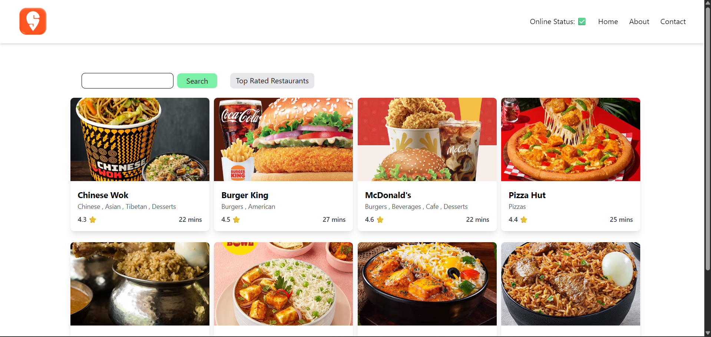

# 🍽️ React Ignition – Swiggy Clone

A simple food delivery frontend inspired by Swiggy, built using **React.js**. This app fetches real-time restaurant data using Swiggy’s public API and supports filtering by search and top-rated restaurants.



---

## 🚀 Features

- 📡 **Live data fetching** from Swiggy API (location-based)
- 🔍 **Search functionality** to filter restaurants by name
- ⭐ **Top Rated filter** – show only restaurants with 4.4+ stars
- ⚡ **Shimmer UI** for loading effect
- 🎯 **Responsive layout** using Tailwind CSS
- 🧠 **Custom hook (`useHomeData`)** for data handling

---

## 🛠️ Built With

- **React.js**
- **Tailwind CSS**
- **React Router DOM**
- **Public Swiggy API Endpoint**

---

## 🧪 How to Run Locally

```bash
git clone https://github.com/your-username/react-ignition.git
cd react-ignition
npm install
npm start
